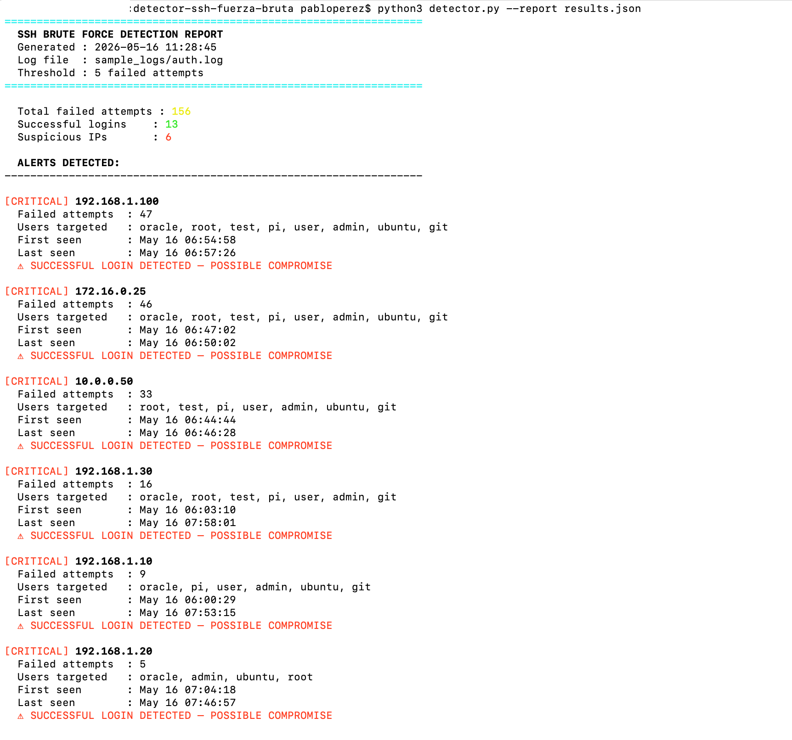

# 🔐 Detector Fuerza Bruta SSH


Herramienta ligera de Python que analiza los registros de autenticación SSH (`auth.log`) para detectar ataques de fuerza bruta, identificar cuentas afectadas y señalar posibles vulnerabilidades, sin necesidad de un SIEM.

---

## 📋 Resumen

Este laboratorio simula un escenario realista de ataque por fuerza bruta SSH y muestra cómo detectar estos ataques a partir de los registros utilizando únicamente Python.  
Entre otras habilidades fundamentales de Blue Team: **análisis de registros**, **detección de patrones**, **generación de alertas** y **exportación de informes**.

### Que detecta

| Patrón | Descripción |
|---|---|
| Umbral de intentos fallidos de inicio de sesión | Direcciones IP que superan N intentos fallidos |
| Enumeración de usuarios | Cuentas target por el atacante |
| Inicio de sesión correcto tras varios intentos fallidos | Posible filtración de credenciales |
| Cronología del ataque | Marcas de tiempo de la primera y última vez que se detectó cada IP |

---

## 🗂️ Estructura del repositoryo

```
detector-ssh-fuerza-bruta/
│
├── detector.py            # Script principal de detección
├── generate_logs.py       # Generador de archivos auth.log simulados
│
├── sample_logs/
│   └── auth.log           # Registro generado con patrones de ataque
│
├── screenshots/
│   ├── report_output.png  # Screenshot informe del terminal
│   └── json_export.png    # Screenshot JSON export
│
└── README.md
```

---

## ⚙️ Requisitos

- Python 3.8+
- Sin dependencias externas: solo la biblioteca estándar

---
## 📸 Output Ejemplo




## 🚀 Guía rapida

### 1. Clonar el repositorio

```bash
git clone https://github.com/papgar92/Detector-Fuerza-bruta-SSH.git
cd Detector-Fuerza-bruta-SSH
```

### 2. Generar sample logs

```bash
python3 generate_logs.py
```

Salida:
```
[+] Log generado: sample_logs/auth.log
[+] Total de entradas: 187
[+] IPs atacantes simuladas: 192.168.1.100, 10.0.0.50, 172.16.0.25
```

### 3. Ejecutar el detector

```bash
python3 detector.py
```

Salida:
```
=================================================================
  SSH BRUTE FORCE DETECTION REPORT
  Generated : 2025-05-16 09:42:11
  Log file  : sample_logs/auth.log
  Threshold : 5 failed attempts
=================================================================

  Total failed attempts : 157
  Successful logins     : 13
  Suspicious IPs        : 3

  ALERTS DETECTED:
-----------------------------------------------------------------

[CRITICAL] 192.168.1.100
  Failed attempts  : 52
  Users targeted   : root, admin, ubuntu, pi
  First seen       : May 16 07:43:01
  Last seen        : May 16 08:01:44
  ⚠ SUCCESSFUL LOGIN DETECTED — POSSIBLE COMPROMISE
...
```

---

## 🔧 Opciones de uso

```bash
# Usar el registro predeterminado (sample_logs/auth.log)
python3 detector.py

# Especificar un archivo de registro personalizado
python3 detector.py /var/log/auth.log

# Cambiar el umbral de detección
python3 detector.py --threshold 10

# Exportar los resultados a JSON
python3 detector.py --report results.json

# Combinar opciones
python3 detector.py /var/log/auth.log --threshold 10 --report results.json
```

---

## 🔍 Lógica de detección

```
1. Analizar cada línea del registro con expresiones regulares
2. Extraer: timestamp, nombre de usuario, IP de origen
3. Agrupar los intentos fallidos por dirección IP
4. Si los intentos son >= umbral → generar una alerta
5. Cruzar los datos con los inicios de sesión correctos → marcar las vulnerabilidades
6. Clasificar la gravedad: MEDIA / ALTA / CRÍTICA
```

### Niveles de gravedad

| Gravedad | Condición |
|---|---|
| `MEDIA` | La IP supera el umbral |
| `ALTA` | La IP supera 3 veces el umbral |
| `CRÍTICA` | Se ha detectado un inicio de sesión correcto en el nivel «Alta» |

---

## 📤 JSON Export

```bash
python3 detector.py --report results.json
```

```json
{
  "generated_at": "2025-05-16T09:42:11",
  "total_failed": 157,
  "total_successes": 13,
  "alerts": [
    {
      "ip": "192.168.1.100",
      "attempts": 52,
      "users_targeted": ["root", "admin", "ubuntu"],
      "first_seen": "May 16 07:43:01",
      "last_seen": "May 16 08:01:44",
      "severity": "CRITICAL",
      "compromised": true
    }
  ]
}
```

---

## 🧪 Pruebas con registros reales

> ⚠️ Realiza las pruebas únicamente en sistemas de tu propiedad o para los que tengas autorización explícita.

Para realizar pruebas con un archivo `auth.log` real de Linux:

```bash
# En una máquina Linux/Kali, copia el registro
scp user@target:/var/log/auth.log ./sample_logs/

# Ejecute el detector
python3 detector.py sample_logs/auth.log --threshold 5
```

Para generar intentos fallidos reales de SSH (en su propia máquina virtual de laboratorio):

```bash
# Desde Kali, simule un ataque de fuerza bruta contra una máquina virtual de destino
hydra -l root -P /usr/share/wordlists/rockyou.txt ssh://TARGET_IP
```

---

## 🔗 Integración con SIEM

La salida JSON es compatible con los flujos de ingestión de registros.  
Para reenviar alertas a Splunk o ELK:

```bash
# Ejemplo: redirigir el JSON a un archivo de registro para la supervisión de Splunk
python3 detector.py --report /var/log/brute_alerts.json

# O enviar con curl a un colector de eventos HTTP de Splunk
curl -k https://splunk:8088/services/collector \
  -H «Authorization: Splunk TU_TOKEN» \
  -d @results.json
```

---

## 🎯 Habilidades demostradas

- Análisis de registros de autenticación SSH
- Análisis de registros mediante expresiones regulares
- Detección de anomalías basada en umbrales
- Clasificación de la gravedad de los incidentes
- Generación de informes estructurados (CLI + JSON)
- Preparación para la integración con SIEM

---

## 📚 Referencias

- [Linux PAM SSH Authentication Logs](https://linux.die.net/man/8/sshd)
- [MITRE ATT&CK T1110 — Brute Force](https://attack.mitre.org/techniques/T1110/)
- [Splunk HTTP Event Collector](https://docs.splunk.com/Documentation/Splunk/latest/Data/UsetheHTTPEventCollector)

---

## ⚠️ Aviso legal

Este proyecto tiene **fines exclusivamente educativos**.  
Todos los ataques simulados se llevan a cabo en entornos de laboratorio aislados.  
No utilices estas técnicas contra sistemas que no sean de tu propiedad o para los que no cuentes con permiso explícito por escrito para realizar pruebas.

---

## 📄 Licencia

Licencia MIT: siéntete libre de utilizarla, modificarla y compartirla.
